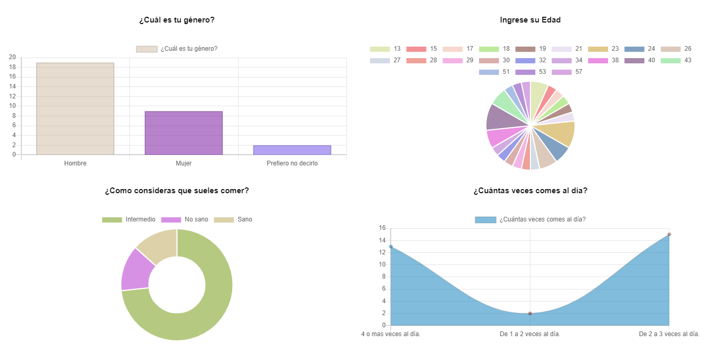

# Graficar Datos de Google Forms

- Contiene un archivo de configuración, en el que se podran cambiar algunos aspectos de las graficas.

```JS

const app = document.getElementById("app");

const clasesDelCuadro = "col s12 m12 l6";
const mostrarInformacion = true;

const defaultGrafica = "polarArea";
const tipoGrafica = [
    "doughnut",
    "line",
    "horizontalBar",
]

const nombreArchivo = "form";
const incluirNombrePreguntas = true;

iniciar();

```

Como definir donde se montaran todas las graficas.

```JS
const app = document.getElementById("app");
```

Colocarle clases css a cada cuadro y mostrar los datos recolectados del archivo.

```JS
const clasesDelCuadro = "col s12 m12 l6";
const mostrarInformacion = true;
```

Definir que tipos de Grafica queremos por defecto o definir cada una de las graficas por separado.

```JS
const defaultGrafica = "polarArea";
const tipoGrafica = [
    "doughnut",
    "line",
    "horizontalBar",
]
```

### Tipos de Graficas "Probadas"

- pie
- doughnut
- line
- bar
- horizontalBar
- polarArea

Asignarle un nombre al archivo .csv y decidir si incluir el nombre de las preguntas del formulario o no.

```JS
const nombreArchivo = "form";
const incluirNombrePreguntas = true;
```

Dar inicio al archivo encargado de las graficas.

```JS
iniciar();
```



---

Sus dependencias son
[Chart.js](https://github.com/chartjs)
y
[jQuery](https://jquery.com/).

Las clases incluidas son de
[Materialize](https://materializecss.com/)
y se pueden cambiar facilmente :D.

---
